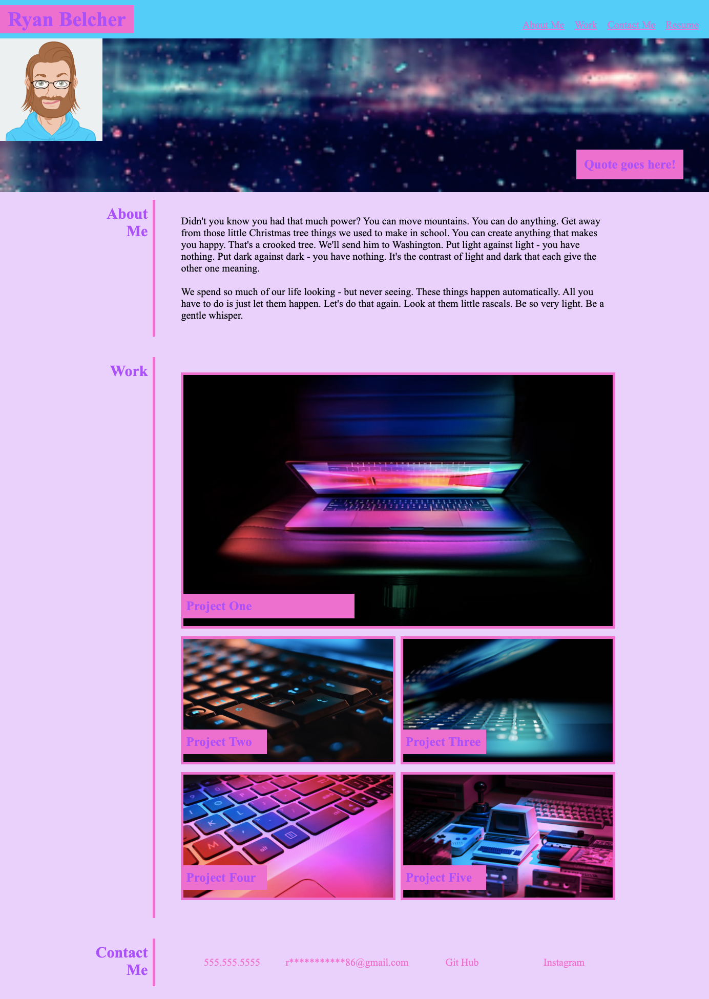

# personal-portfolio

## Description

This is the first iteration of my personal portfolio web page. In its current version, it is only linking to one project since that is all I really have done thus far. It is definitly a work in progress, but I am pleased with how it has turned out to this point. It is laid in three sections, each section has a title and the main piece of the section which includes text, photos, and links depending on the section. At larger screen sizes, the title sits next to the main piece of the section and at smaller screen sizes it will all stack. This was acheived by using media queries. To get the page laid out the way it is, I made use of CSS Flexbox and CSS grid. My design was inspired by the vaporwave aesthetic. I have no design expierence and little design knowledge and did not set out with this particular design aesthetic in mind but it just sort of fell in place. 

As I move forward in my career as a web dev, I am excited to see how this project evolves and takes shape. I do not know what that might look like at this time but it certainly will involve linking my upcoming projects, tweaking the design among other things. Say tuned...

## Installation

This page can be accessed at ryanmbelcher.github.io/personal-portfolio

## Usage

 

## Credits

css-tricks.com has proved to be a most valuable resource for my understanding of Flexbox and Grid and some guidance on how to style my hovers.

Photo Credits: 

image 1: Photo by <a href="https://unsplash.com/@badashproducts?utm_source=unsplash&utm_medium=referral&utm_content=creditCopyText">Ash Edmonds</a> on <a href="https://unsplash.com/s/photos/computer?utm_source=unsplash&utm_medium=referral&utm_content=creditCopyText">Unsplash</a>

image 2: Photo by <a href="https://unsplash.com/@christianw?utm_source=unsplash&utm_medium=referral&utm_content=creditCopyText">Christian Wiediger</a> on <a href="https://unsplash.com/s/photos/computer?utm_source=unsplash&utm_medium=referral&utm_content=creditCopyText">Unsplash</a>
  

image 3: Photo by <a href="https://unsplash.com/@fantasyflip?utm_source=unsplash&utm_medium=referral&utm_content=creditCopyText">Philipp Katzenberger</a> on <a href="https://unsplash.com/s/photos/computer?utm_source=unsplash&utm_medium=referral&utm_content=creditCopyText">Unsplash</a>
  

image 4: Photo by <a href="https://unsplash.com/@mylifeasaryan_?utm_source=unsplash&utm_medium=referral&utm_content=creditCopyText">Aryan Dhiman</a> on <a href="https://unsplash.com/s/photos/computer?utm_source=unsplash&utm_medium=referral&utm_content=creditCopyText">Unsplash</a>
  

image 5: Photo by <a href="https://unsplash.com/@lorenzoherrera?utm_source=unsplash&utm_medium=referral&utm_content=creditCopyText">Lorenzo Herrera</a> on <a href="https://unsplash.com/s/photos/computer?utm_source=unsplash&utm_medium=referral&utm_content=creditCopyText">Unsplash</a>
  
Vaporwave color theme is courtesy of lélé goffin.

## License

MIT License

Copyright (c) 2022 RyanMBelcher

Permission is hereby granted, free of charge, to any person obtaining a copy
of this software and associated documentation files (the "Software"), to deal
in the Software without restriction, including without limitation the rights
to use, copy, modify, merge, publish, distribute, sublicense, and/or sell
copies of the Software, and to permit persons to whom the Software is
furnished to do so, subject to the following conditions:

The above copyright notice and this permission notice shall be included in all
copies or substantial portions of the Software.

THE SOFTWARE IS PROVIDED "AS IS", WITHOUT WARRANTY OF ANY KIND, EXPRESS OR
IMPLIED, INCLUDING BUT NOT LIMITED TO THE WARRANTIES OF MERCHANTABILITY,
FITNESS FOR A PARTICULAR PURPOSE AND NONINFRINGEMENT. IN NO EVENT SHALL THE
AUTHORS OR COPYRIGHT HOLDERS BE LIABLE FOR ANY CLAIM, DAMAGES OR OTHER
LIABILITY, WHETHER IN AN ACTION OF CONTRACT, TORT OR OTHERWISE, ARISING FROM,
OUT OF OR IN CONNECTION WITH THE SOFTWARE OR THE USE OR OTHER DEALINGS IN THE
SOFTWARE.
